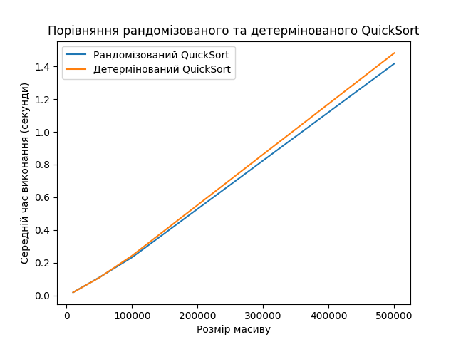

## Завдання 1. Порівняння рандомізованого та детермінованого `QuickSort`

Реалізуйте рандомізований та детермінований алгоритми сортування `QuickSort`. Проведіть порівняльний аналіз їхньої ефективності, вимірявши середній час виконання на масивах різного розміру.

**Технічні умови**

1. Для реалізації рандомізованого алгоритму `QuickSort` реалізуйте функцію `randomized_quick_sort(arr)`, де опорний елемент `(pivot)` обирається випадковим чином.

2. Для реалізації детермінованого алгоритму `QuickSort` реалізуйте функцію `deterministic_quick_sort(arr)`, де опорний елемент обирається за фіксованим правилом: перший, останній або середній елемент.

3. Створіть набір тестових масивів різного розміру: `10_000`,` 50_000`, `100_000` та `500_000` елементів. Заповніть масиви випадковими цілими числами.

4. Виміряйте час виконання обох алгоритмів на кожному масиві. Для більш точної оцінки повторіть сортування кожного масиву 5 разів та обчисліть середній час виконання.

**Приклад побудови графіку програмою**



**Приклад виведення в термінал виконання програми**

```
Розмір масиву: 10000
   Рандомізований QuickSort: 0.0189 секунд
   Детермінований QuickSort: 0.0189 секунд

Розмір масиву: 50000
   Рандомізований QuickSort: 0.1104 секунд
   Детермінований QuickSort: 0.1090 секунд

Розмір масиву: 100000
   Рандомізований QuickSort: 0.2333 секунд
   Детермінований QuickSort: 0.2435 секунд
.
Розмір масиву: 500000
   Рандомізований QuickSort: 1.4166 секунд
   Детермінований QuickSort: 1.4815 секунд
```

## Завдання 2. Складання розкладу занять за допомогою жадібного алгоритму

Реалізуйте програму для складання розкладу занять в університеті, використовуючи жадібний алгоритм для задачі покриття множини. Мета полягає в призначенні викладачів на предмети таким чином, щоб мінімізувати кількість викладачів та покрити всі предмети.

**Технічні умови**

Дано множину предметів: `{'Математика', 'Фізика', 'Хімія', 'Інформатика', 'Біологія'}`

Список викладачів:

1. Олександр Іваненко, 45 років, `o.ivanenko@example.com`, предмети: `{'Математика', 'Фізика'}`
2. Марія Петренко, 38 років, `m.petrenko@example.com`, предмети: `{'Хімія'}`
3. Сергій Коваленко, 50 років, `s.kovalenko@example.com`, предмети: `{'Інформатика', 'Математика'}`
4. Наталія Шевченко, 29 років, `n.shevchenko@example.com`, предмети: `{'Біологія', 'Хімія'}`
5. Дмитро Бондаренко, 35 років, `d.bondarenko@example.com`, предмети: `{'Фізика', 'Інформатика'}`
6. Олена Гриценко, 42 роки, `o.grytsenko@example.com`, предмети: `{'Біологія'}`

**Опис завдання**

Реалізуйте клас `Teacher` з такими атрибутами:

- `first_name` (ім'я)
- `last_name` (прізвище)
- `age` (вік)
- `email` (електронна пошта)
- `can_teach_subjects` (множина предметів, які може викладати)
- Реалізуйте функцію `create_schedule(subjects, teachers)`, яка використовує жадібний алгоритм для призначення викладачів на предмети. Функція повинна повернути список викладачів та предмети, які їм призначено.
- Під час вибору викладача на кожному етапі віддавайте перевагу тому, хто може викладати найбільшу кількість предметів, які ще не охоплені. Якщо таких кандидатів кілька, обирайте наймолодшого за віком.

**Шаблон програми**

```
# Визначення класу Teacher
class Teacher:
    pass

def create_schedule(subjects, teachers):
   pass

if __name__ == '__main__':
    # Множина предметів
    subjects = {}
    # Створення списку викладачів
    teachers = []

    # Виклик функції створення розкладу
    schedule = create_schedule(subjects, teachers)

    # Виведення розкладу
    if schedule:
        print("Розклад занять:")
        for teacher in schedule:
            print(f"{teacher.first_name} {teacher.last_name}, {teacher.age} років, email: {teacher.email}")
            print(f"   Викладає предмети: {', '.join(teacher.assigned_subjects)}\\n")
    else:
        print("Неможливо покрити всі предмети наявними викладачами.")
```
